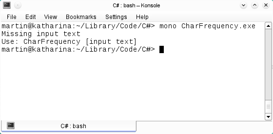
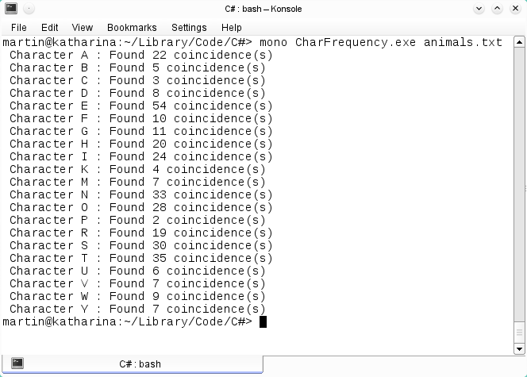

# Programa que suma el total de caracteres en un archivo de texto.
    

      Una de las características fundamentales de cualquier lenguaje de programación es el trabajo con caracteres, todo programa fuente se compone de una secuencia de caracteres que el compilador interpreta.
  Como ejemplo un programa que muestra el total de coincidencias de un carácter en un archivo de texto, utilizando los métodos más usuales para convertir cadenas en arreglos de caracteres y viceversa.
    

<b>Fig 1. El programa requiere un archivo de texto.</b>
 
      

 
      
<b>Fig 2. El resultado de la ejecución del programa.</b>
 
      

 

